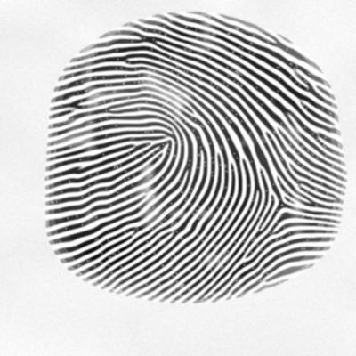
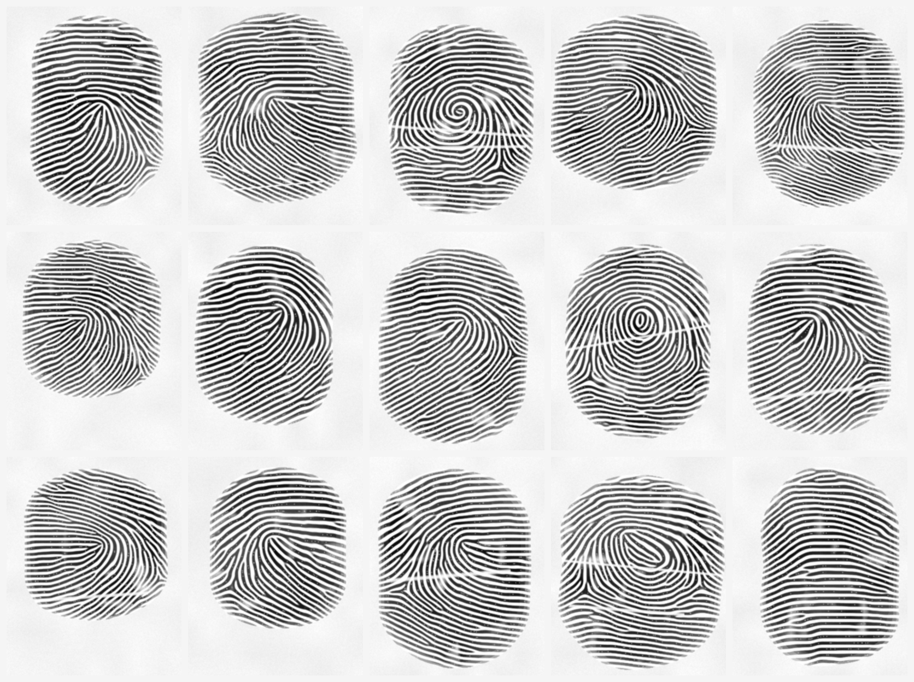
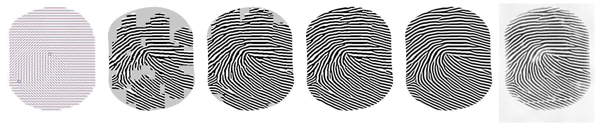
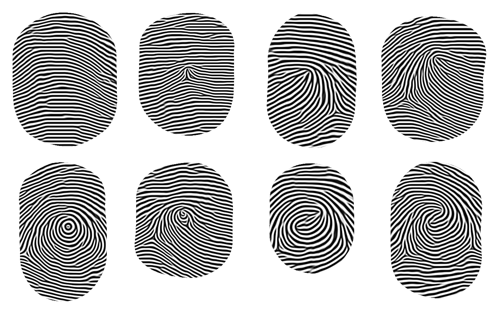
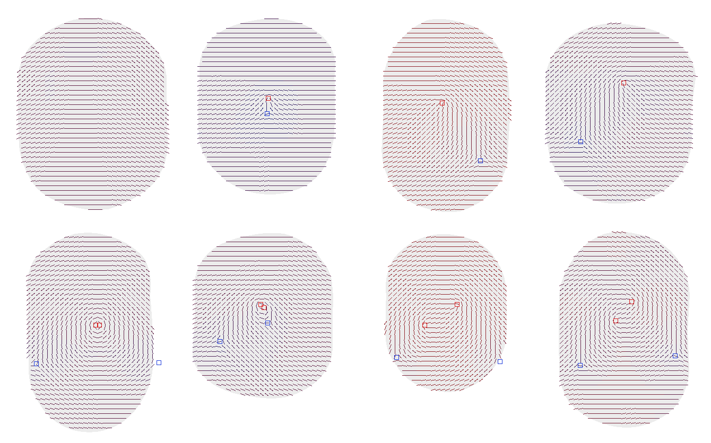
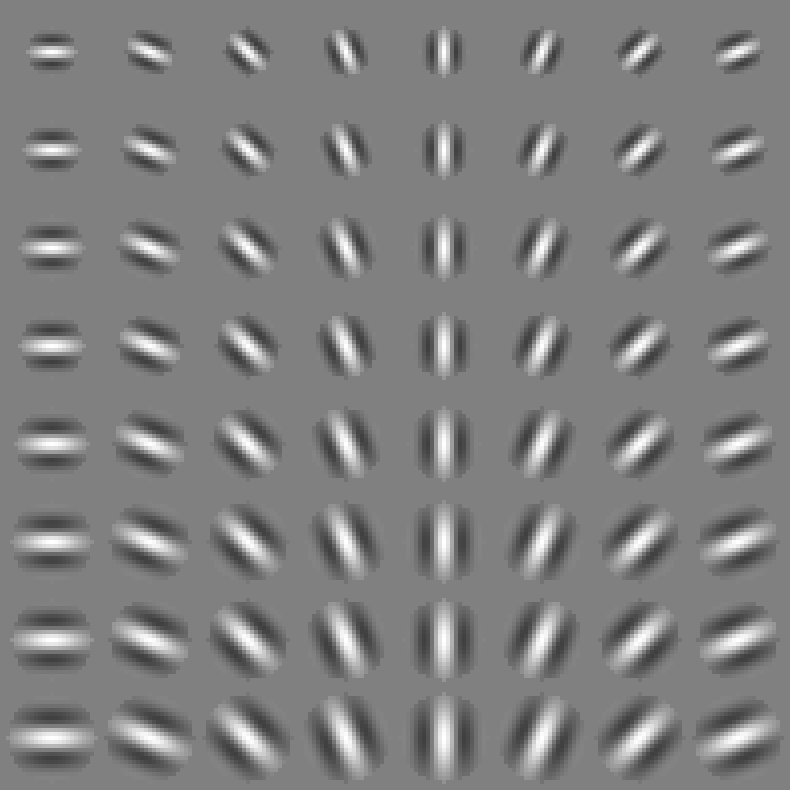
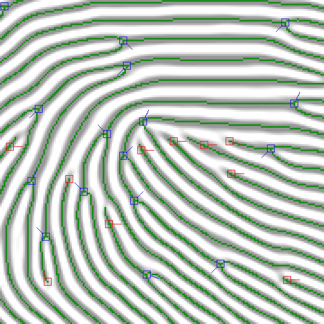
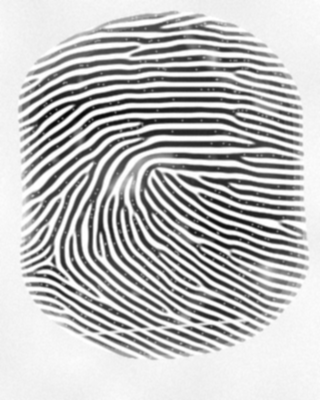

<p align="center"></p>
<h1 align="center">actual-fingerprints</h1>

Synthetic human fingerprints from a seed. Same seed, same print, byte for byte, on any machine. No dependencies, runs in Node 18 and up, ships ESM and CommonJS with types.

The icon above is `generate('actual-fingerprints')`. It is a left loop with 44 minutiae and a ridge period of 8.1 px.

The generator follows the SFinGe recipe from the University of Bologna: pick a pattern class, place the singular points, derive a ridge orientation field from them, then grow ridges by repeatedly filtering a few random seeds with oriented Gabor kernels. Ridge endings and bifurcations are not placed; they appear where growth fronts collide, which is also why they look right. On top of that there is a minutiae extractor, a marching-squares SVG tracer, a PNG encoder, a pass that makes the result look like a pressed ink print, and a small minutiae matcher.

I wrote it for a game server that needed one believable print per character without storing images. Store the seed, regenerate on demand.

<p align="center"></p>
<p align="center"><sub>Seeds <code>citizen-1001</code> through <code>citizen-1015</code>, rendered through <code>ink()</code>. Nothing here was drawn by hand.</sub></p>

## Install

    npm install actual-fingerprints

## Usage

```js
import { writeFileSync } from 'node:fs'
import { generate, ink, toPNG, toSVG, compare } from 'actual-fingerprints'

const print = generate('citizen-4821')

print.pattern        // 'right-loop'
print.period         // 9.46, mean ridge spacing in px
print.minutiae[0]    // { x: 131, y: 88, angle: 2.36, type: 'ending' }
print.pixels         // Uint8Array, 320 * 400, 0 is ridge, 255 is paper

writeFileSync('clean.png', toPNG(print))
writeFileSync('pressed.png', toPNG(ink(print)))
writeFileSync('print.svg', toSVG(print))

compare(print, generate('citizen-4821')).score   // 1
compare(print, generate('citizen-4822')).score   // 0.02
```

CommonJS works the same way with `require('actual-fingerprints')`.

| | |
|---|---|
| `generate(seed, options?)` | `seed` is a string or number. Options: `width` and `height` in px (320 by 400), `pattern` to force a class, `hand` (`'left'` or `'right'`) to bias loops toward the ulnar side, `density` from 0 to 1 for minutiae count (0.5). Returns a `Fingerprint`. |
| `ink(print)` | A new `Fingerprint` with the same minutiae and pixels that look like a pressed print: pressure variation, faded edges, pores, dry patches, creases, paper. Deterministic from the seed. |
| `toSVG(print, options?)` | Ridges traced as one even-odd `<path>`. `tolerance` in px (0.75), `fill`, `background`. |
| `toPNG(print)` | 8-bit grayscale PNG tagged as 500 dpi. |
| `toDataURL(print)` | The PNG as a `data:` URL. |
| `compare(a, b)` | `{ score, matched, rotation, dx, dy }`. Score is 0 to 1. |

`Fingerprint` has `seed`, `width`, `height`, `pattern`, `period`, `pixels`, `mask` (the fingertip silhouette, 0 or 1) and `minutiae`. `Pattern` is one of `arch`, `tented-arch`, `left-loop`, `right-loop`, `whorl`, `central-pocket`, `double-loop`, `accidental`. Minutia angles are radians in image coordinates, pointing into the ridge for an ending and along the fork for a bifurcation.

## How it works

<p align="center"></p>
<p align="center"><sub>Seed <code>citizen-1002</code>, left to right: orientation field with the core in red and the delta in blue; ridge state after passes 1, 2 and 4 (grey is untouched); the converged result; the same print through <code>ink()</code>.</sub></p>

### Pattern class and singular points

The seed is hashed and feeds a small PRNG. The first draw picks the class from population frequencies close to what is reported for the general population, with whorls split into their Henry subtypes:

| class | per 1000 |
|---|---|
| left loop, right loop | 315 each |
| plain whorl | 240 |
| double loop | 40 |
| central pocket | 30 |
| accidental | 10 |
| plain arch | 40 |
| tented arch | 10 |

Passing `hand` shifts the loop mass so that 94% of loops open toward the ulnar side, as they do on real hands.

Each class then places its cores and deltas inside ranges expressed as fractions of the image. A loop gets one core near the middle and a delta down and to the side opposite the opening. A whorl gets two cores a few pixels apart and two deltas low on either side. A tented arch is a core with a delta directly under it. A plain arch has no singular points at all and uses a separate smooth field. Every singular point also gets eight sector offsets, small random angles that bend the field around it, which is what makes one loop fat and another one narrow.

<p align="center"></p>
<p align="center"><sub>One print per class, forced with the <code>pattern</code> option. Top: arch, tented arch, left loop, right loop. Bottom: whorl, central pocket, double loop, accidental.</sub></p>

### Orientation field

Ridge direction at a pixel comes from the zero-pole model of Sherlock and Monro. Cores are zeros and deltas are poles, so

    theta(p) = tilt + 1/2 * ( sum over cores of arg(p - c) - sum over deltas of arg(p - d) )

with the piecewise-linear sector correction of Vizcaya and Gerhardt applied to each `arg` term. Far from the singular points the field settles to horizontal plus a small global tilt. The result is quantized to 32 orientation bins, 5.6 degrees each, which is fine enough that the banding is not visible in the ridges.

<p align="center"></p>
<p align="center"><sub>The fields behind the eight prints above, sampled every 9 px. Stroke colour follows the local ridge period, blue for tight, red for wide.</sub></p>

The ridge period is drawn once per print from a clamped normal around 9.4 px, roughly 500 dpi, then modulated across the image: 12% tighter near deltas and a 4% lattice noise everywhere. It is quantized to 8 bins between 7 and 12 px. Earlier versions also widened the period above the core, which is what textbooks describe, but that turned out to force a phase dislocation on every whorl: a ring of ridges around the core passed through a wider zone on top and a normal zone below, the phase could not close, and the growth absorbed the mismatch as a straight seam. Dropping that term removed the seams entirely.

The silhouette is the SFinGe shape, a rectangle capped by two half-ellipses with independent left and right half-widths and a 4% edge jitter, covering 60 to 70 percent of the image.

### Ridge growth

This is where the print actually comes from. The state is a ternary image: +1 ridge, -1 valley, 0 blank. It starts empty except for about 45 seeds at the default density, 3 by 3 blocks placed by Poisson-disk sampling with a spacing of two ridge periods, plus one seed on each core and delta. Every pass replaces each pixel inside the silhouette with the sign of its Gabor response, where the kernel is chosen by that pixel's orientation and period bins.

<p align="center"></p>
<p align="center"><sub>The kernel bank. Rows are period 7 to 12 px, columns are orientation 0 to 157.5 degrees in 22.5 degree steps; every fourth of the 32 orientations is shown.</sub></p>

The bank holds 256 kernels, built once when the module loads. Each has a circular support of radius `0.9 T`, a Gaussian envelope with `sigma = 0.38 T` across the ridge and `0.48 T` along it, a cosine of period `T` across, and the mean subtracted so an empty neighbourhood produces no response. Values are quantized to `Int16` with the absolute sum normalized to 32768, so with ternary input the accumulator never leaves `Int32`.

Three details matter for speed and convergence:

- Passes run in place, sweeping the 16 by 16 blocks forward on even passes and backward on odd ones. A double-buffered update fell into two-cycles and never settled.
- A pixel that already has a sign only flips when the response exceeds 4096, an eighth of full scale. Blank pixels fill on any sign. Without this, about a thousand boundary pixels flipped forever and every print ran to the pass cap.
- Blocks are marked dirty when any pixel in them changes; the next pass only visits dirty blocks and their neighbours. After coverage, which takes three or four passes, most of the image is idle.

Growth stops when fewer than `max(16, pixels / 1000)` pixels change in a pass, or after 20 passes. Typical prints settle in 5 to 13. Afterwards one more response pass produces the grey image: 128 minus the response shifted right by 7, clamped. The ridge edges get their soft ramp from that, and the ternary state never appears in the output.

There is one repair round. If an interior pixel ends with a response below 2048 in magnitude, it sits at the centre of a valley or ridge too wide for the kernel to see, and a 3 by 3 block of the opposite sign is planted there before settling again. That inserts a ridge ending where two fronts met out of phase, which is what skin does too.

### Minutiae

The grey image is thresholded, thinned with Zhang and Suen's algorithm, and cleaned of staircase corners. Spurs shorter than 10 px are pruned from every free end before anything is counted; without that step, thinning leaves two-pixel forks on ridge tips that read as bifurcations, and the ending to bifurcation ratio comes out inverted.

<p align="center"></p>
<p align="center"><sub>Three times zoom around the core of <code>citizen-1002</code>. Green is the skeleton. Red boxes are endings, blue boxes are bifurcations, the tick is the assigned direction.</sub></p>

Crossing number on the pruned skeleton gives the type: 1 for an ending, 3 for a bifurcation. Direction for an ending is the vector to the point reached by walking eight pixels along the skeleton. For a bifurcation, all three branches are walked, the two with the smallest mutual angle form the fork, and the direction is their bisector, the same convention as ISO 19794-2.

Anything within 10 px of the silhouette edge is dropped, since those are cuts, not features. Two endings within 6 px facing each other are a broken ridge and both go; two bifurcations within 6 px are a hole and both go; any pair closer than 4 px keeps only one. What remains is sorted by row and column. Default density gives a median of about 40 minutiae per print with roughly equal numbers of endings and bifurcations. Real rolled prints run closer to two endings per bifurcation, which I have not tried to correct.

### Rendering

`toSVG` runs marching squares over the binary ridge map with a fixed saddle rule, links the segments through integer edge ids, and simplifies every closed contour with Douglas-Peucker. At zero tolerance the vector fill reproduces the pixel map exactly; at the default 0.75 px it agrees on 98.3% of pixels and a print comes to about 9 KB. The output is one `<path>` with `fill-rule="evenodd"`, which is correct here because contours from a binary image never cross and nesting strictly alternates ridge and valley.

<p align="center"></p>
<p align="center"><sub><code>toSVG(generate('citizen-1002'))</code>, 9.4 KB.</sub></p>

`toPNG` writes an 8-bit grayscale PNG by hand, CRC table and all, and uses `node:zlib` for the deflate. It sets `pHYs` to 19685 pixels per metre so viewers report 500 dpi.

`ink` is the difference between a ridge map and something that looks like it came off a finger. It blurs the clean image, shifts the ridge threshold by a slow lattice noise so ridges thicken and thin, scales darkness by a pressure field and by distance from the silhouette edge so the border fades and thins, punches faint pores on about one skeleton pixel in twenty, lightens ridges inside dry patches, draws zero to two flexion creases, puts a textured paper tone outside the finger, adds a little sensor noise and blurs once more. All of it comes from a forked stream of the same seed.

<p align="center"></p>

### Matching

`compare` is a plain alignment matcher in the spirit of Ratha et al. For every pair of minutiae, one from each print, it hypothesises the rotation and translation that maps one onto the other, transforms the whole first set, and counts one-to-one matches within 10 px and 25 degrees, with a type mismatch worth half. The second set lives in a 16 px grid so each lookup touches at most four cells, and a hypothesis is abandoned as soon as it cannot beat the best so far. The score is `matched^2 / (nA * nB)`.

| pair | score |
|---|---|
| a print against itself | 1.000 |
| same print, minutiae shifted 9 px right and 5 px up | 1.000 |
| same print, rotated 8 degrees about the centre | 1.000 |
| same print, only the top half of its minutiae (30 of 44) | 0.682 |
| three unrelated prints | 0.014, 0.015, 0.019 |

Anything above 0.3 is the same finger for practical purposes. This is not a forensic matcher; it has no tolerance for elastic distortion and it has not been evaluated against anything but its own output.

## Determinism

The promise is that a seed produces identical bytes on every machine and every Node version. Two things threaten that in JavaScript. `Math.random` is the obvious one, and nothing here touches it; all randomness comes from a 53-bit hash of the seed string feeding an sfc32 generator, with independent sub-streams forked by label for the class, shape, period, seeds and ink. The subtle one is that `Math.sin`, `Math.cos`, `Math.exp` and `Math.atan2` are not required to be correctly rounded, and their last bits have changed between engines and between V8 versions. A one-ulp difference in a kernel value can flip a pixel, and a flipped pixel changes every pass after it.

So none of those functions are used. `fmath.ts` has its own sine, exponential and arctangent built from addition, multiplication and division only, which IEEE 754 rounds identically everywhere: range reduction followed by a Taylor series, accurate to better than 1e-9. Everything that reaches a pixel is then quantized, to an orientation bin, a period bin, or an `Int16` kernel value, so even that residual error has no path to the output. The growth loop itself is pure integer arithmetic.

The test suite pins FNV hashes of the pixels for six seeds and one inked print. If one of those changes it is a major version, because someone's stored seeds now mean something else.

## Performance

Measured from the built package on a laptop with Node 22.23, single thread, warm:

| call | time |
|---|---|
| `generate` at 320 by 400 | 104 ms |
| `ink` | 6.5 ms |
| `toSVG` | 1.5 ms |
| `toPNG` | 1.9 ms |
| `compare`, 44 against 42 minutiae | 1.7 ms |

Growth is nearly all of it: about 215 multiply-adds per pixel per pass over 83 thousand pixels, for 5 to 13 passes, with the block skipping cutting the later passes down to the parts of the image still moving. There are no allocations inside the loops and the kernel bank is shared across calls.

## Limitations

Only one impression per finger. There is no notion of a partial, rotated or smudged lift of the same print yet; `ink` always renders the whole fingertip with the same geometry. The minutiae mix is about one to one where real skin gives two endings per bifurcation. The silhouette is a symmetric capsule, so rolled prints with their wider, irregular outline are not represented. Whorls with two cores less than a period apart can produce a small dot or ring at the very centre. None of this has been validated against real biometric data or a commercial matcher; the aim was believable prints, deterministic and fast, not a benchmark dataset.

## Layout

    src/
      prng.ts       seed hash, sfc32, forked streams
      fmath.ts      sin, cos, exp, atan2 from basic arithmetic
      pattern.ts    class roll, singular points, sector offsets, base period
      field.ts      silhouette, orientation and period bins, kernel ids
      gabor.ts      the kernel bank, built at load
      grow.ts       seeds, in-place Gabor passes, repair round, grey render
      skeleton.ts   Zhang-Suen thinning
      minutiae.ts   pruning, crossing number, directions, filters
      generate.ts   the pipeline and the Fingerprint type
      ink.ts        pressed-print rendering
      svg.ts        marching squares and simplification
      png.ts        encoder
      compare.ts    alignment matcher
      index.ts      exports
    test/           vitest, golden hashes, a 1000-seed population check under SLOW=1
    bench/          one script over dist
    docs/           the figures in this file, all rendered by the library

`pnpm test` typechecks and runs the suite, `pnpm build` produces `dist/`, `pnpm bench` builds and prints timings.

## References

- R. Cappelli, D. Maio, D. Maltoni. Synthetic fingerprint-database generation. ICPR 2002. And the SFinGe chapter of the Handbook of Fingerprint Recognition.
- B. G. Sherlock, D. M. Monro. A model for interpreting fingerprint topology. Pattern Recognition 26(7), 1993.
- P. R. Vizcaya, L. A. Gerhardt. A nonlinear orientation model for global description of fingerprints. Pattern Recognition 29(7), 1996.
- T. Y. Zhang, C. Y. Suen. A fast parallel algorithm for thinning digital patterns. Communications of the ACM 27(3), 1984.
- N. K. Ratha, K. Karu, S. Chen, A. K. Jain. A real-time matching system for large fingerprint databases. IEEE PAMI 18(8), 1996.
- A. H. Ansari. Generation and storage of large synthetic fingerprint database. M.E. thesis, IISc Bangalore, 2011. The Anguli generator, which confirmed that a discrete kernel bank is enough.

## License

MIT
